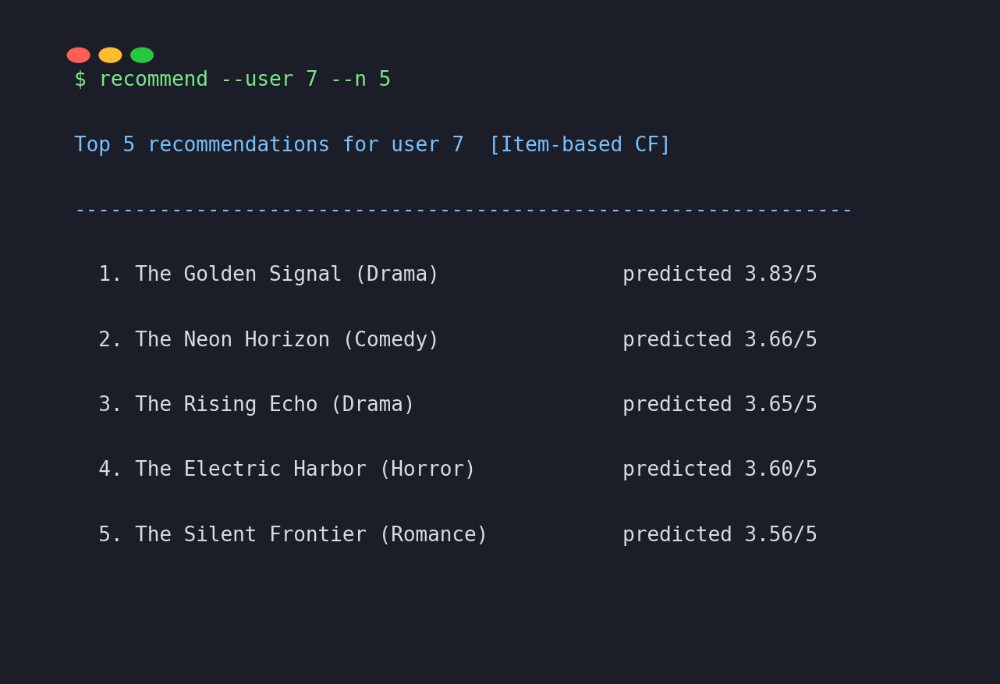
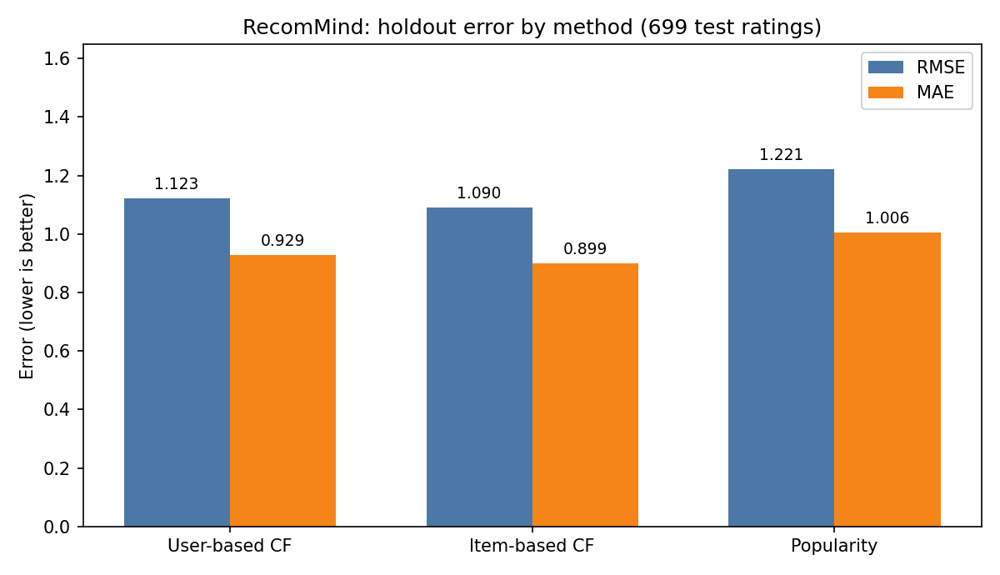

# RecomMind — recommendation engine from scratch

[](https://www.python.org/)
[](https://numpy.org/)
[](LICENSE)
[](#testing)
[](#)

**RecomMind** is a movie recommender built the hard way: every algorithm is
implemented from scratch in pure Python + numpy — no sklearn, no surprise,
no black boxes, no API keys, fully offline.

> *"Users who liked the same movies you did also liked…"* — that's not a
> slogan here, it's literally the code in `recommind/models.py`.

## Features

- **Synthetic MovieLens-style dataset generator** — seeded latent-factor
  model (user/item factors + genre preferences), bundled as
  `data/ratings.csv` + `data/items.csv` (3,496 ratings, 200 users × 80 items)
- **User-based collaborative filtering** — k-NN over mean-centered cosine
  similarity computed on co-rated items
- **Item-based collaborative filtering** — adjusted cosine similarity over
  co-rating users, with user-mean-centered predictions
- **Popularity baseline** — doubles as the **cold-start fallback** for
  unknown users, unrated items, and empty neighbourhoods
- **Top-N recommendation** function that never suggests already-seen items
- **Evaluation from scratch** — RMSE and MAE on a seeded 80/20 holdout
  split, with a results table comparing all three methods
- **CLI** — `recommend`, `evaluate`, `demo` commands
- **Real test suite** — 17 pytest tests covering similarity math,
  recommendation invariants, metric correctness, and seed determinism

## Screenshots

**Real CLI output** (`recommend --user 7 --n 5`):



**Real holdout results** (RMSE/MAE on 699 test ratings):



| Method              | RMSE   | MAE    |
| ------------------- | ------ | ------ |
| Item-based CF       | 1.0897 | 0.8989 |
| User-based CF       | 1.1232 | 0.9294 |
| Popularity baseline | 1.2213 | 1.0060 |

Both neighbourhood methods beat the naive popularity baseline — the
collaborative signal is real, not memorized.

## Tech stack

| Layer            | Choice                                                              |
| ---------------- | ------------------------------------------------------------------- |
| Language         | Python 3.9+                                                         |
| Numerics         | numpy (pinned) — the only runtime dependency besides matplotlib     |
| Algorithms       | User-based CF, item-based CF, cosine similarity (plain + adjusted), |
|                  | k-nearest neighbours, RMSE / MAE, seeded train/test split           |
| Charts           | matplotlib (pinned)                                                 |
| Tests            | pytest                                                              |
| Data             | Synthetic, generated in-repo — no downloads, no keys, offline       |

Deliberately **not** used: sklearn, surprise, implicit, torch. The point of
this project is the algorithms, so they're written out longhand.

## Quickstart

```bash
git clone https://github.com/872000/recommind.git
cd recommind
pip install -r requirements.txt
pip install -e .          # installs the `recommend` command
```

```bash
# Top-5 picks for user 7 (item-based CF by default)
recommend --user 7 --n 5

# Try the other engines
recommend --user 7 --n 5 --method user
recommend --user 7 --n 5 --method popularity

# RMSE/MAE comparison of all three methods on the holdout set
recommend evaluate

# End-to-end: generate data -> train -> recommend -> evaluate
recommend demo

# Run the test suite
python3 -m pytest -q
```

No install? The CLI also runs as a module:

```bash
PYTHONPATH=. python3 -m recommind.cli --user 7 --n 5
```

## Project structure

```
recommind/
├── recommind/
│   ├── __init__.py      # public API
│   ├── data.py          # synthetic ratings generator + CSV bundle loader
│   ├── similarity.py    # cosine similarity from scratch
│   ├── models.py        # UserBasedCF, ItemBasedCF, PopularityBaseline, recommend()
│   ├── evaluate.py      # RMSE, MAE, holdout evaluation from scratch
│   └── cli.py           # `recommend` / `evaluate` / `demo` commands
├── data/
│   ├── ratings.csv      # bundled demo ratings (user_id, item_id, rating)
│   └── items.csv        # bundled demo catalog (item_id, title, genre)
├── tests/
│   └── test_recommind.py# 17 pytest tests
├── scripts/
│   ├── make_charts.py        # regenerates assets/rmse_chart.png
│   └── make_cli_screenshot.py# regenerates assets/cli_demo.png
├── assets/
│   ├── hero.png         # banner
│   ├── rmse_chart.png   # real evaluation chart
│   └── cli_demo.png     # real CLI output, rendered as a terminal shot
├── requirements.txt
├── pyproject.toml
└── LICENSE (MIT)
```

## How it works (the 30-second version)

1. **Data** — `generate_ratings()` draws hidden taste vectors for users and
   items; a rating is the dot product of those vectors plus genre affinity
   and noise, clipped to 1–5 stars. Seeded, so it's reproducible.
2. **Similarity** — cosine similarity over co-rated entries, with ratings
   centered on each user's mean (adjusted cosine), so similarity measures
   shared *taste*, not shared generosity.
3. **Prediction** — user-based CF averages the deviations of the k most
   similar users; item-based CF averages the user's own ratings on the k
   most similar items. Anything un-predictable falls back to popularity.
4. **Evaluation** — 20% of ratings are held out before training; RMSE/MAE
   are computed on the held-out ratings only.

## Roadmap

- [ ] Matrix factorization (SGD-based, from scratch) as a fourth method
- [ ] Precision@K / Recall@K ranking metrics
- [ ] Hyperparameter sweep CLI (`--k` grid search)
- [ ] Streamlit demo UI reusing the same engine
- [ ] Bigger synthetic catalog (1k users) + timing benchmarks

## License

MIT — see [LICENSE](LICENSE).
